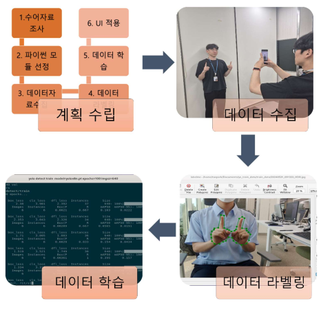
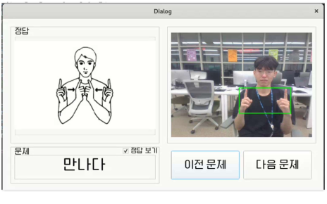

# sign-language-learning-app

# 배움손길

YOLOv8 기반 웹캠 수어 단어 학습 프로그램 프로토타입입니다.  
사용자의 수어 동작을 인식하고, 퀴즈형 방식으로 단어 학습을 지원하는 것을 목표로 개발했습니다.

## 개발 기간
- 2024.06 ~ 2024.07

## 사용 기술
- Python
- YOLOv8
- Qt Designer / PySide6
- OpenCV

## 주요 기능
- 웹캠 입력 기반 수어 동작 인식
- 퀴즈형 단어 학습
- 정답 판별 및 학습 흐름 제공
- UI 기반 학습 화면 구성

## 담당 역할
- 프로젝트 총괄
- 기능 기획
- 데이터 수집 및 라벨링
- 모델 학습
- UI 연동
- 사용자 인터뷰 기반 개선 방향 도출

## 데이터셋
약 500장의 수어 이미지 데이터를 직접 수집 및 라벨링하여 학습에 활용했습니다.

## 실행 방법
```bash
pip install -r requirements.txt
python main.py

## 프로젝트 진행과정


## 애플리케이션 동작 흐름


## 출력 UI

